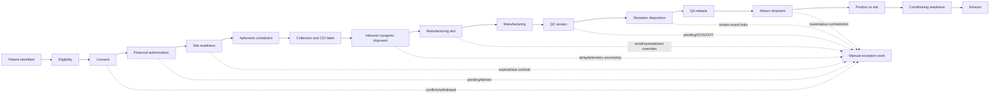
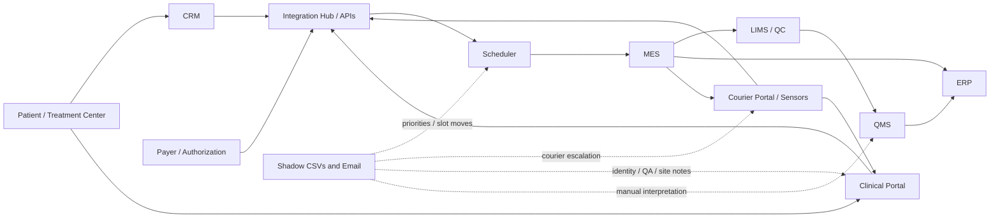

# Stage 2 - Current-State Process and Architecture

**Status:** Reconstructed from synthetic evidence; stakeholder validation pending  
**Last updated:** 2026-09-14

## 1. Current-state SIPOC

| Suppliers | Inputs | Process | Outputs | Customers/recipients |
|---|---|---|---|---|
| Patient, treatment center, CRM, clinical portal, payer | Identity, eligibility, consent, authorization, site readiness | Enroll and qualify patient | Candidate treatment journey | Patient, Clinical Operations |
| Apheresis team, treatment center | Patient identity, collection appointment, COI/bag identifiers | Collect and label material | Patient-specific collection | Logistics, manufacturing site |
| Courier, sensors, treatment center | Collection, custody evidence, route, telemetry | Transport inbound material | Material received or exception | Manufacturing Operations, Quality |
| Planner, scheduler, manufacturing site, ERP | Priority, capacity, authorization, collection timing | Reserve and manage slot | Planned/confirmed capacity | Clinical, manufacturing, logistics |
| MES, manufacturing operator | Collection/material/COI, slot, recipe/product | Manufacture batch | Manufactured batch | QC laboratory, Quality |
| LIMS/QC, QMS, Quality/QP | Assay evidence, deviations, SOPs, approval identity | Test, investigate and release | Released/held/rejected product evidence | Logistics, treatment center, patient |
| Courier, sensors, manufacturing site | Released product, route, custody and telemetry | Transport return product | Product at treatment center or exception | Clinical team, Quality |
| Clinical team, treatment center | Product readiness, patient readiness, conditioning authorization | Prepare and infuse | Infusion outcome | Patient and follow-up services |

## 2. Reconstructed value stream

The linear view is conceptual. The evidence shows repeated re-planning, late events, manual reconciliation and cross-domain exceptions.

## 3. Current-state journey failure points

| Journey point | Current evidence | Failure mode | Consequence |
|---|---|---|---|
| Identity/enrollment | CRM, clinical export, patients table | MRN/DOB/center/name disagreement | Wrong or unresolved patient linkage |
| Consent/authorization | Consent and payer tables | Withdrawn, expired, conditional, pending or denied state ignored | Invalid downstream progression |
| Site readiness | Center reference plus detailed qualification table | Summary and detailed controls disagree | Collection scheduled at unready site |
| Collection/COI | Collection table and source identifiers | Weak evidence-edge model | Broken or unprovable patient-material lineage |
| Inbound logistics | Shipment, event and telemetry evidence | Impossible times, stale status, missing/poor-quality sensor values | Incorrect receipt/viability assumption |
| Slot management | Scheduler, MES, spreadsheet and email | Confirmed/cancelled conflict, retry duplication, override outside system | Double booking or lost capacity |
| Manufacturing | MES events and batch table | Duplicate start events and status ambiguity | Incorrect progression or duplicated commands |
| QC/deviation | QC, deviation, QMS and events | Non-pass rows, open deviations, missing event links | Incomplete disposition evidence |
| QA release | QMS plus legacy rule | MES/ERP substituted for Quality authority | Premature readiness conclusion |
| Return logistics | Shipment/event/telemetry | Arrival/status contradiction and thermal uncertainty | Product availability/viability uncertainty |
| Conditioning/infusion | Journey string plus upstream records | State ahead of QMS release | Patient preparation based on unsafe derived state |

## 4. Current system landscape

This is a reconstructed landscape, not a verified production topology. The supplied APIs and data simulate system boundaries but do not prove actual enterprise integration behavior.

## 5. Current-state C4 context

### People

- Clinical Operations and treatment-center coordinators.
- Manufacturing and supply-chain planners.
- Manufacturing operators.
- QC laboratory and QA/QP reviewers.
- Logistics operators and courier partners.
- Technology support and governance functions.

### Systems

- CRM and clinical source views.
- Consent and insurance-authorization stores.
- Scheduler and manufacturing-slot records.
- MES batch status and manufacturing events.
- LIMS/QC results.
- QMS release and deviation evidence.
- ERP availability state.
- Courier, shipment and telemetry evidence.
- Shadow spreadsheets and email.
- Legacy read APIs and diagnostic package.

### Current orchestration boundary

The baseline provides a read-oriented `LegacyRepository`, diagnostics, skeletal APIs and naive rules. It does not provide a trustworthy orchestration system, canonical event store, conflict workflow, command ledger, identity resolution, authorization, signed approvals or complete audit trail.

## 6. Data-flow assessment

| Flow | Data | Current issue |
|---|---|---|
| CRM -> patient view | Identity and enrollment | Conflicts with clinical source are not adjudicated |
| Clinical -> patient view | Subject, MRN, DOB, center and status | Source-specific authority is not represented |
| Scheduler -> MES | Slot and start intent | Confirmed/cancelled conflicts and retry duplication |
| MES -> LIMS/QMS | Batch progression | Manufacturing completion is confused with release |
| LIMS -> QMS | QC evidence | Result disposition is not explicit in supplied model |
| QMS -> ERP/logistics/clinical | Release state | Downstream states can advance without consistent release evidence |
| Courier/sensor -> logistics/clinical | Status, custody and telemetry | Time, status and sensor evidence disagree |
| Email/CSV -> human action | Priority, route, identity, QA and site decisions | Uncontrolled, weakly owned and not linked to audit/event state |

## 7. Trust boundaries

| Boundary | Trust concern | Required treatment later |
|---|---|---|
| External treatment center/courier -> enterprise | Identity, data quality, timing, malicious/untrusted text | Authentication, validation, provenance, isolation and review |
| Source system -> integration/orchestrator | Schema/version drift and replay | Contract validation, idempotency, source metadata and quarantine |
| Shadow content -> AI/context | Prompt injection, stale facts and PHI | Treat as data, scrub/minimize, cite sources, never execute embedded text |
| AI assistant -> human workflow | Hallucination, overconfidence and automation bias | Recommendation-only output, evidence/confidence, independent rule checks |
| Human approval -> consequential command | Spoofed role or weak signature | Authenticated identity, authorization, intent, reason and non-repudiation |
| Orchestrator -> MES/QMS/scheduler | Partial transactions and duplicate effects | Command ledger, outbox/inbox, concurrency and compensation |
| Operational data -> dashboards/reports | Overstated certainty or stale projection | As-of time, provenance, freshness, conflicts and uncertainty |

## 8. Attribute and decision authority hypothesis

| Concern | Primary authority/evidence | Caveat |
|---|---|---|
| CRM enrollment | CRM | Not authoritative for clinical identity adjudication or release |
| Clinical identity/milestones | Clinical source plus authorized reconciliation | Conflicts remain unresolved until approved |
| Consent | Controlled consent record and Clinical authority | Effective version and revocation must be evaluated |
| Financial authorization | Payer/authorization source | Provisional scheduling may differ from downstream readiness |
| Site qualification | Detailed training/equipment/agreement evidence | High-level status may be stale or oversimplified |
| Collection and COI | Collection/label/custody evidence | Relationship must remain evidence-bearing |
| Shipment/custody | Courier events, custody records and telemetry | No individual signal is sufficient for disposition |
| Manufacturing execution | MES | Completion is not Quality release |
| QC evidence | LIMS/QC plus approved disposition | OOS/OOT/pending must be contextualized |
| Product release | QMS plus authorized Quality approval | QMS is decision authority, not a global master |
| Inventory availability | ERP | Does not establish product release or patient readiness |
| Journey readiness | Versioned derived evaluation | Must expose inputs, time, policy, conflicts and required authority |

## 9. Current-state conclusion

The estate needs an evidence-preserving reference and orchestration layer that assigns authority by attribute/decision, reconstructs state bitemporally, exposes conflicts and coordinates reversible commands. It must not overwrite source differences or declare one global database authoritative.

The [six supplied patient examples](07_SUPPLIED_PATIENT_JOURNEY_SOURCE_RECONSTRUCTION.md) now show what can be reconstructed from frozen v2 rows today: a cited occurrence-time order with unresolved controls. That bounded example does **not** deliver the target bitemporal/known-at projection, because source ingest/decision histories are incomplete.
