# Stage 3 - Root-Cause Analysis

**Status:** Evidence-backed causal hypothesis; stakeholder validation pending  
**Last updated:** 2026-09-14

## 1. Core causal model

```mermaid
flowchart TD
    A[Unsafe or unexplained journey decisions] --> B[Semantic fragmentation]
    A --> C[Evidence and provenance gaps]
    A --> D[Weak cross-system orchestration]
    A --> E[Fragmented exception operations]
    A --> F[Authority and assurance gaps]

    B --> B1[Same words mean different states]
    B --> B2[No attribute-level authority]
    B --> B3[No canonical decision model]

    C --> C1[Identity and lineage conflicts]
    C --> C2[Broken event links]
    C --> C3[Occurred and recorded time conflated]
    C --> C4[Missing uncertainty/disposition]

    D --> D1[No idempotent command identity]
    D --> D2[No inbox/outbox or command ledger]
    D --> D3[No compensation/recovery state]

    E --> E1[Email and spreadsheet workflows]
    E --> E2[Unowned cases]
    E --> E3[No common SLA/outcome model]

    F --> F1[Roles asserted rather than authenticated]
    F --> F2[Human approval not technically enforced]
    F --> F3[Tests do not cover end-to-end risk]
```

## 2. Five-whys - unsafe readiness

1. **Why can a journey appear ready without QMS release?** The legacy rule accepts manufacturing/MES or ERP state as readiness.
2. **Why are those states treated as equivalent?** Shared strings are used without a domain decision model that separates manufacturing completion, inventory availability, Quality release and patient readiness.
3. **Why is there no shared model?** Source systems evolved independently and the integration exposes data rather than governed decisions.
4. **Why do missing gates remain invisible?** Consent, authorization, site, shipment, QC and deviation evidence are not evaluated together with source, time and authority.
5. **Why was this not prevented or detected?** Requirements, rule ownership, traceability, negative tests and operational decision telemetry are incomplete.

**Root-cause statement:** Readiness is implemented as an unowned convenience predicate over partial source status rather than a versioned, evidence-bearing and authority-approved decision.

## 3. Five-whys - identity and lineage uncertainty

1. **Why can patient attributes disagree?** CRM and clinical sources contain different MRN, DOB, center and name/alias evidence.
2. **Why can the system not resolve or abstain safely?** It lacks evidence-bearing identity assertions, match features, confidence and conflict cases.
3. **Why is MRN insufficient?** It is duplicated and formatted differently across sources.
4. **Why is a correction hard to audit?** There is no authorized resolution workflow with before/after evidence and effective time.
5. **Why does this affect the whole journey?** Patient identity anchors collection, COI, shipment, batch, product and infusion relationships.

**Root-cause statement:** The estate treats identifiers as direct facts instead of source-specific evidence requiring governed reconciliation.

## 4. Five-whys - duplicate/conflicting capacity action

1. **Why can retries create duplicate work?** Commands lack an idempotency key and payload binding.
2. **Why can systems disagree after action?** Scheduler and MES updates are separate partial transactions.
3. **Why is recovery ambiguous?** There is no persistent command ledger, saga state or compensating action.
4. **Why does manual reconciliation continue?** Formal workflow does not expose partial state, owner, retry history or recovery decision.
5. **Why is this not tested?** Current tests encode only a few known defects and no fault-injection harness executes the ten supplied scenarios.

**Root-cause statement:** Cross-system work is modeled as isolated calls rather than an idempotent, observable and recoverable business transaction.

## 5. Five-whys - shadow operations and slow exception resolution

1. **Why do teams use spreadsheets and email?** Formal systems do not present a complete, trusted cross-domain exception view.
2. **Why is the view incomplete?** Exceptions use different identifiers, states and ownership across source systems.
3. **Why are cases unowned or old?** There is no common lifecycle, assignment, SLA, escalation and closure record.
4. **Why cannot automation close the gap safely?** Evidence quality, authority and consequences differ by exception type.
5. **Why would a generic AI assistant be unsafe?** Untrusted messages can contain PHI, stale claims or adversarial instructions, and the assistant lacks decision authority.

**Root-cause statement:** Human workarounds compensate for missing cross-domain case orchestration; the solution needs governed workflow before AI summarization.

## 6. Five-whys - thermal and Quality uncertainty

1. **Why can a temperature point trigger the wrong conclusion?** Legacy code applies a superseded single-point threshold.
2. **Why is a point inadequate?** Effective v7 requires duration, sensor quality, cumulative profile, shipper integrity and Quality review.
3. **Why can evidence be incomplete?** Telemetry includes missing/warning values and shipment status contradictions.
4. **Why can Quality context be lost?** Deviations do not resolve to events and assay disposition is not modeled explicitly.
5. **Why must a human remain responsible?** Product disposition is consequential and requires authorized Quality judgment over the evidence.

**Root-cause statement:** The estate replaces a contextual, human-authorized disposition process with incomplete point data and unversioned Boolean logic.

## 7. Root causes versus symptoms

| Symptom | Proximate cause | Deeper cause | Intervention type |
|---|---|---|---|
| MES/QMS conflict count | Different source states | No canonical semantics/authority | Domain and deterministic engineering |
| Duplicate MRNs | Identifier collision | No evidence-based identity resolution | Data/domain workflow plus human authority |
| Repeated emails | Formal workflow gap | No cross-domain case lifecycle | Process/application redesign; bounded AI support |
| Duplicate start event | Retry with new ID | No semantic idempotency/command ledger | Integration engineering |
| Impossible timeline | Bad/late source timestamps | No bitemporal/quality model | Data/event engineering |
| Unowned escalation | Optional owner field | No operational RACI/SLA enforcement | Operating-model and workflow design |
| Poor release forecast | Fragmented/late evidence | No trustworthy feature/outcome baseline | Data foundation before predictive modeling |

## 8. Causal validation plan

The hypotheses will be challenged by:

- Stage 5 domain-owner review of meanings and decision authority.
- Stage 6 data lineage and quality profiling.
- Stage 7 evaluation cases that isolate each failure mechanism.
- Stage 8 rules-only and bounded-AI comparison.
- Stage 14 defect-first tests and integrated POCs.
- Stage 15 fault injection, adversarial testing and human-approval checks.
- Stage 19 before/after and counter-metric analysis.
