# Stage 3 - KPI Tree and Baseline

**Status:** Baseline established; numerical targets remain hypotheses pending Stages 7/8  
**Machine-readable sources:** `kpi_baseline.csv` and `kpi_baseline.json`  
**Last updated:** 2026-09-14

## 1. Measurement truth rule

The challenge supplies ten business baselines but does not supply their calculation formulas. They are preserved as `PROVIDED_NOT_REPRODUCED`. Eighteen additional metrics are calculated from verified source evidence and marked `REPRODUCED`.

The two groups must not be presented with the same confidence.

## 2. North-star outcome

**Safe, on-time and evidence-complete individualized therapy journeys with accountable human authority.**

The north star is intentionally composite; no single metric can represent safety, flow and trust.

## 3. KPI tree

```mermaid
flowchart TD
    N[Safe, on-time, evidence-complete journey]
    N --> S[Safety and authority]
    N --> F[Flow and timeliness]
    N --> T[Traceability and data trust]
    N --> R[Reliability and recovery]
    N --> H[Human effectiveness and adoption]
    N --> C[Cost and capacity]

    S --> S1[Unsafe readiness rate]
    S --> S2[Unauthorized consequential action rate]
    S --> S3[Identity conflict resolution quality]
    S --> S4[Consent/site/Quality gate violations]

    F --> F1[Vein-to-vein days]
    F --> F2[On-time infusion probability]
    F --> F3[Avoidable delay]
    F --> F4[Exception age]

    T --> T1[Cross-system traceability completeness]
    T --> T2[Resolvable evidence links]
    T --> T3[Temporal anomaly rate]
    T --> T4[Provenance coverage]

    R --> R1[Duplicate side effects]
    R --> R2[Slot-state conflicts]
    R --> R3[Recovery objective attainment]
    R --> R4[Degraded-mode safety]

    H --> H1[Manual reconciliation]
    H --> H2[Manual status updates]
    H --> H3[Unowned exceptions]
    H --> H4[Recommendation rejection/override]

    C --> C1[Slot utilization]
    C --> C2[Cost per successful outcome]
    C --> C3[Model/token cost]
```

## 4. Supplied business baselines

| KPI | Baseline | Direction | Evidence status |
|---|---:|---|---|
| Median vein-to-vein days | 21.8 days | Down | Provided, formula not supplied |
| Journeys requiring manual reconciliation | 31.5% | Down | Provided, formula not supplied |
| Avoidable delay per 100 journeys | 186 hours | Down | Provided, formula not supplied |
| On-time infusion probability | 78.0% | Up | Provided, formula not supplied |
| Identity reconciliation exceptions per 1,000 | 17 | Down | Provided, formula not supplied |
| Open exception mean age | 29.4 hours | Down | Provided, formula not supplied |
| Slot utilization | 71.0% | Up | Provided, formula not supplied |
| QA-release forecast MAE | 27.5 hours | Down | Provided, formula not supplied |
| Manual status updates per journey | 12.7 | Down | Provided, formula not supplied |
| Cross-system traceability complete | 82.4% | Up | Provided, formula not supplied |

These values are valid synthetic challenge inputs, but Stage 6 must define their populations, time windows and formulas before Stage 19 uses them for a before/after claim.

## 5. Reproduced forensic baselines

| KPI ID | Metric | Baseline | Interpretation |
|---|---|---:|---|
| SAFE-001 | Legacy-ready records not QMS released | 30.661% | 153 of 499 legacy-ready journeys |
| SAFE-002 | Legacy-ready records with invalid consent | 6.012% | 30 of 499; overlapping population |
| SAFE-003 | Legacy-ready records without approved authorization | 41.082% | 205 of 499; milestone policy required |
| SAFE-004 | Legacy-ready records with site-control gap | 29.058% | 145 of 499; overlapping population |
| SAFE-005 | Stored infused/infusion-ready state without QMS release | 105 records | State contradiction, not proven physical infusion |
| ID-001 | Duplicate MRN groups | 2 | MRN is not a unique enterprise key |
| ID-002 | Cross-source identity-field disagreements | 52 | Field disagreements; patients may repeat |
| QUAL-001 | Deviations open/investigating | 71.809% | 135 of 188; blocking meaning unavailable |
| TRACE-001 | Unresolved deviation/event links | 100% | 188 of 188 links blank or missing |
| TIME-001 | Impossible shipment timeline | 0.562% | 9 of 1,600 shipments |
| TIME-002 | Maximum event recording lag | 12 hours | Must be observed/handled, not blindly minimized |
| ORCH-001 | Scheduler/MES slot conflict | 1.125% | 9 of 800 slots |
| ORCH-002 | Retry-duplicate manufacturing-start events | 7 | Semantic duplicates beyond unique event ID |
| OPS-001 | Formal/shadow priority disagreement | 65.375% | 523 of 800 patients |
| OPS-002 | Courier escalations open | 67.742% | 21 of 31 |
| OPS-003 | Courier escalations unowned | 25.806% | 8 of 31 |
| LOG-001 | Arrival present while status not delivered | 24.875% | 398 of 1,600 shipments |
| DATA-001 | Missing/warning telemetry points | 0.289% | 37 of 12,800 points |

## 6. POC acceptance KPIs

These are proposed acceptance thresholds, not achieved results.

| KPI | Proposed POC threshold | Counter-metric/guard |
|---|---|---|
| Unauthorized consequential actions | 0 across all tests | Human approval latency and failed legitimate authorization |
| Invented identity/lineage links | 0 | Abstention/manual-review volume |
| P0 gate violations | 0 | False-block rate on approved normal golden cases |
| Duplicate side effects on idempotent replay | 0 | Conflict detection and command latency |
| Displayed decision facts with source/time provenance | 100% in three POCs | Operator readability and task time |
| Original evaluation cases safely handled | 6/6 | No case-specific hard-coding |
| Failure injections reach safe known state | 10/10 | Recovery time and manual burden |
| Critical exception ownership | 100% | Alert fatigue and reassignment count |
| Agent recommendations exposing evidence, uncertainty and authority | 100% | Recommendation usefulness/rejection rate |
| Clean local reproduction | 100% of documented commands | Setup duration and dependency reliability |

## 7. KPI ownership hypothesis

| KPI domain | Accountable owner | Measurement steward |
|---|---|---|
| Patient/identity/consent readiness | Clinical Operations | Data/Product |
| QA release and deviation control | Quality/QP | Quality systems/data steward |
| Manufacturing capacity and slot integrity | Manufacturing Operations | Scheduler/platform owner |
| Logistics and thermal exceptions | Logistics plus Quality | Logistics/data steward |
| Traceability and provenance | Data Owner | Platform/data engineering |
| Security and authority | Security/Privacy plus business authority | Platform/security engineering |
| Reliability/recovery | Service Owner/SRE | Platform engineering |
| Value/adoption | Product/Capstone Owner | Analytics/Product Operations |

## 8. Measurement gaps

- Supplied business-KPI formulas and time windows are absent.
- No baseline measures authenticated authority or attempted unauthorized action.
- No baseline measures operator task time, evidence-search time, recommendation usefulness or automation bias.
- No baseline measures RTO/RPO or degraded-mode safety.
- No baseline measures model/token cost or cost per successful business outcome.
- No ground truth states which deviations or QC results are blocking/dispositioned.

Stages 6 and 7 must close or explicitly accept these gaps before numerical benefit targets are approved.
