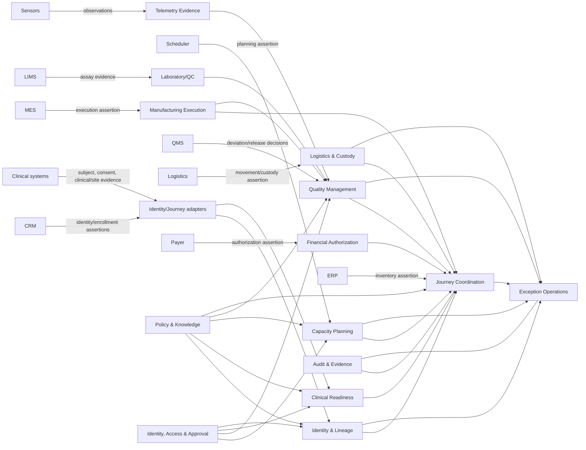
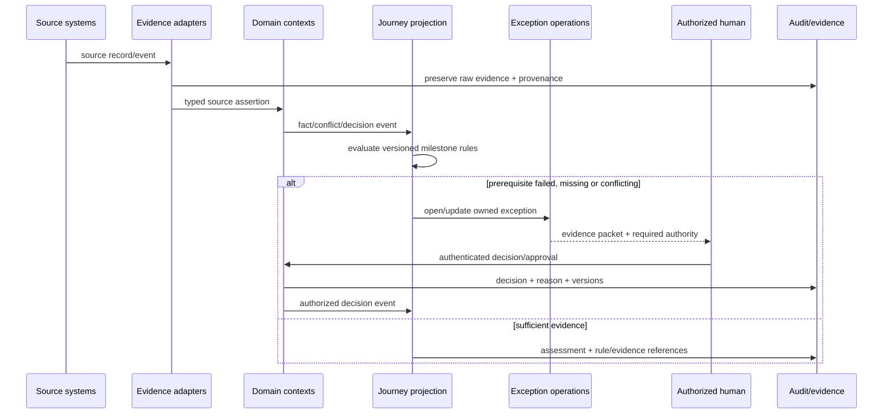

# Stage 5 - Capability, Bounded-Context and Context Map

**Status:** READY FOR REVIEW; academic G1 approved; owner validation pending  
**Last updated:** 2026-09-14

## 1. Domain capability map

| Capability group | Capabilities | Classification |
|---|---|---|
| Patient/journey | Enrollment evidence, journey projection, milestone assessment, downstream-impact view | Core |
| Identity/lineage | Identity assertions, conflict detection, resolution case, COI/COC evidence | Core |
| Capacity/orchestration | Slot constraints, reservation, idempotency, saga/recovery, compensation | Core |
| Quality/release | QC evidence, deviation lifecycle, release prerequisites, disposition/approval | Core |
| Logistics | Shipment planning/tracking, custody evidence, telemetry profile, exception handling | Supporting with core safety interaction |
| Clinical/site | Consent, clinical readiness evidence, site qualification | Supporting with human authority |
| Manufacturing | Execution state, batch/material linkage and acknowledgements | External/supporting |
| Commercial | Financial authorization status and validity | Supporting |
| Case operations | Ownership, SLA, escalation, evidence packet and outcome | Core operational capability |
| Policy/knowledge | Versioned rules, SOP metadata, effective dates and decision tables | Core assurance capability |
| Access/approval/audit | Authentication, authorization, separation of duties, signing, append-only audit | Generic platform with core safety role |
| Observability/evaluation | Traces, metrics, replay, test evidence, drift and cost | Generic platform |

## 2. Bounded contexts

| Context | Owns | Does not own | Key output |
|---|---|---|---|
| Journey Coordination | Therapy journey projection and milestone assessments | Source facts, identity resolution or release authority | `JourneyProjectionUpdated`, `MilestoneAssessmentRecorded` |
| Identity and Lineage | Source identity assertions, conflict/resolution cases, verified relationship decisions | Clinical diagnosis or source-record correction | `IdentityConflictDetected`, `IdentityResolutionApplied`, `COIEvidenceVerified` |
| Clinical Readiness | Consent and clinical/site prerequisite assertions | Product disposition or manufacturing capacity | `ConsentStateObserved`, `ClinicalMilestoneAuthorized` |
| Site Qualification | Time-bound training/equipment/agreement evidence | Clinical or Quality decisions outside the site-control policy | `SiteQualificationChanged` |
| Capacity Planning | Slot proposals/reservations and deterministic feasibility | MES execution or clinical priority policy ownership | `SlotReserved`, `ReservationConflictDetected` |
| Manufacturing Execution | Batch execution evidence and material consumption/production acknowledgements | Quality release | `ManufacturingStarted`, `ManufacturingCompleted` |
| Laboratory/QC | Assay observations/results and reporting evidence | Batch/product release | `QCResultReported` |
| Quality Management | Deviations, impact/disposition and authorized release decision | Manufacturing execution state | `DeviationOpened`, `DeviationDispositioned`, `ProductReleased` |
| Logistics and Custody | Shipment plan/movement/receipt and COC evidence | Product acceptance/disposition | `ShipmentDeparted`, `ShipmentArrived`, `CustodyTransferred` |
| Telemetry Evidence | Immutable sensor observations and controlled profile features | Product disposition | `TelemetryObserved`, `ThermalProfileCalculated` |
| Financial Authorization | Authorization assertion, validity and payer evidence | Clinical eligibility or Quality release | `AuthorizationChanged` |
| Exception Operations | Cross-context case, ownership, SLA, escalation and closure | Source-domain decision authority | `ExceptionAssigned`, `ExceptionEscalated`, `ExceptionClosed` |
| Policy and Knowledge | Versioned rules/SOP references/effective intervals | Runtime decisions or source data | `PolicyPublished`, `PolicySuperseded` |
| Identity, Access and Approval | Authenticated principals, permissions, approvals/signatures | Business evidence or decision content | `ApprovalRecorded`, `AuthorizationDenied` |
| Audit and Evidence | Immutable audit envelope, evidence reference and transformation lineage | Business state | `AuditEntryAppended` |

## 3. Context relationships

Each source boundary uses an anti-corruption adapter. It maps source syntax into source-specific assertions while retaining the raw value, source record and times; it does not silently translate a source status into a consequential canonical decision.

## 4. Integration rules

1. Contexts publish immutable domain events and expose versioned query/command contracts.
2. Commands identify one intended action with an idempotency key and payload digest.
3. External acknowledgements are new facts; absence/timeout is `UNKNOWN`, not failure or success.
4. Canonical projections consume facts and decisions but cannot alter their source history.
5. Quality release is consumed only from the Quality context's authorized decision event.
6. Identity relationships are consumed only after an authorized resolution/verification decision.
7. Late and correction events rebuild projections using occurred and recorded time.
8. Cross-context exceptions use common case/ownership semantics while the domain context retains decision authority.

## 5. Primary process context

## 6. Migration implication

The target is a strangler/evidence-layer migration, not a big-bang master-data replacement:

1. Ingest and compare without writing to legacy sources.
2. Build read-only projections and exception cases.
3. Add controlled commands only after idempotency, authority and compensation tests.
4. Run shadow comparison before any consequential integration.
5. Keep rollback to source workflows and AI-disabled operation.
