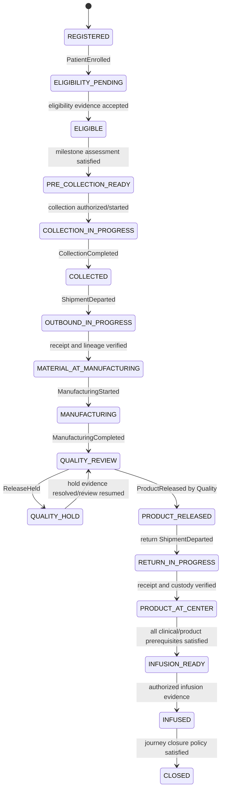
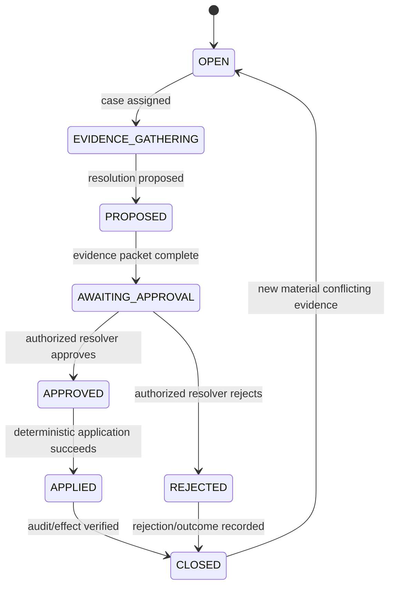
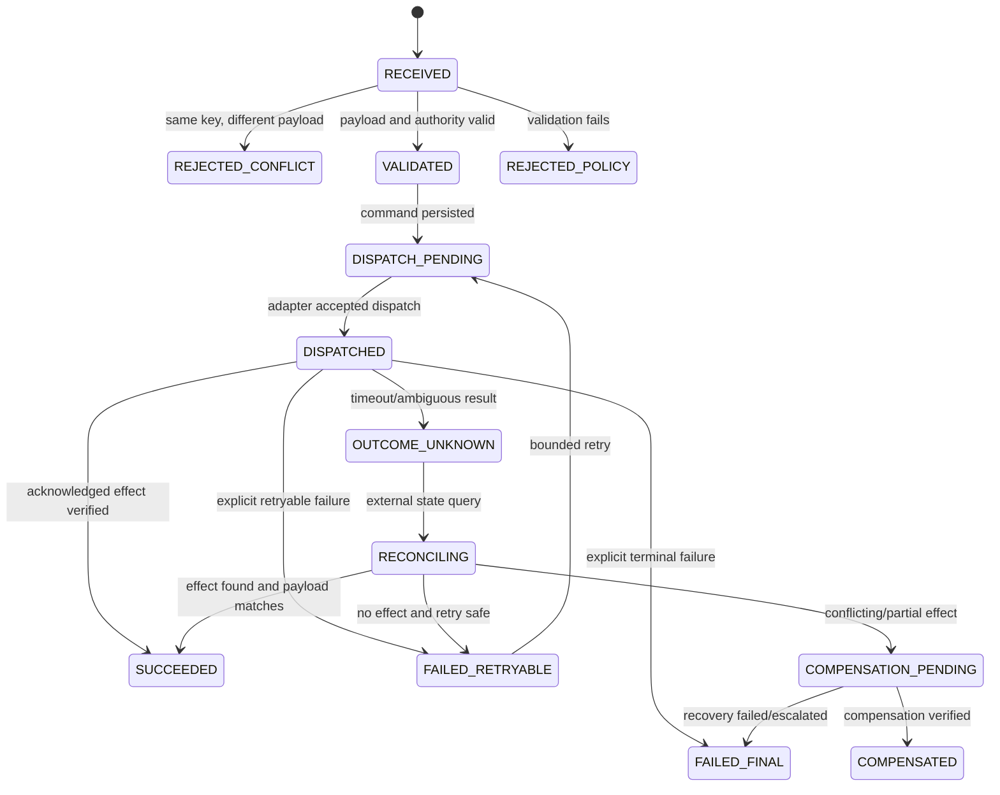
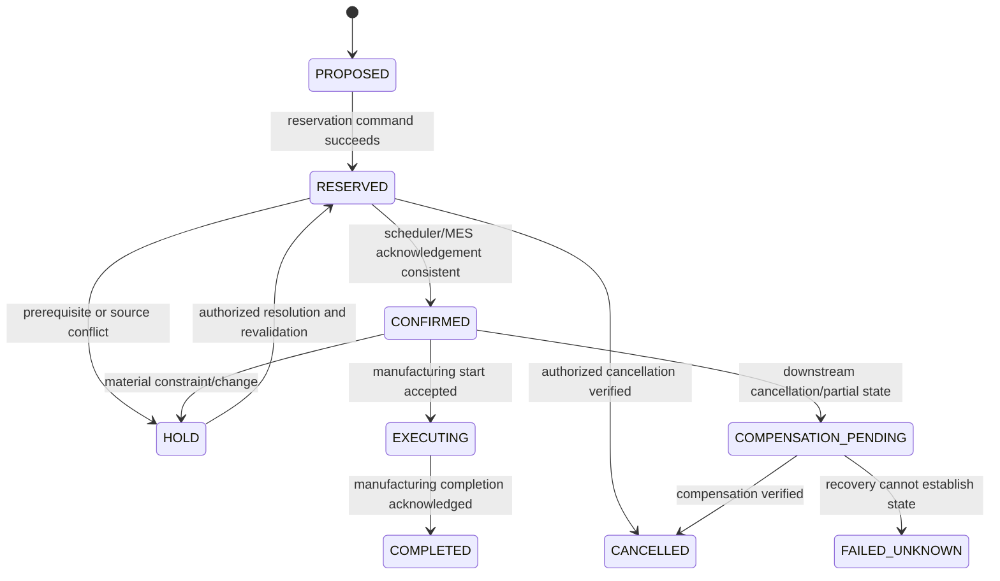
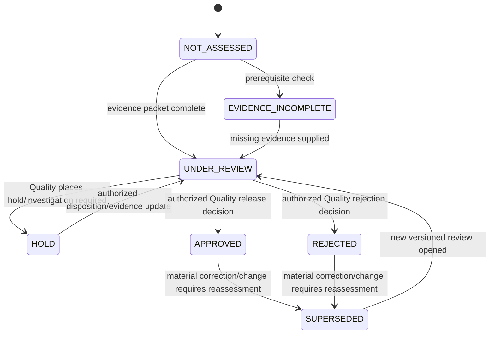
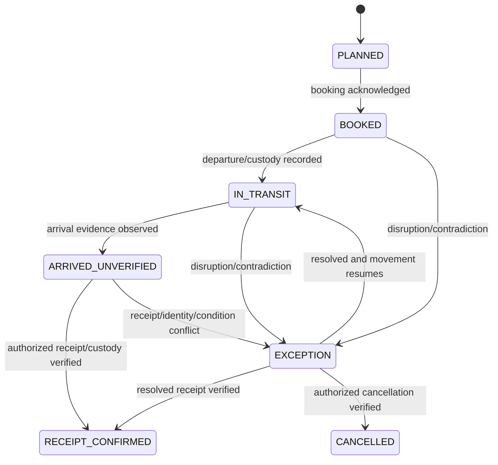
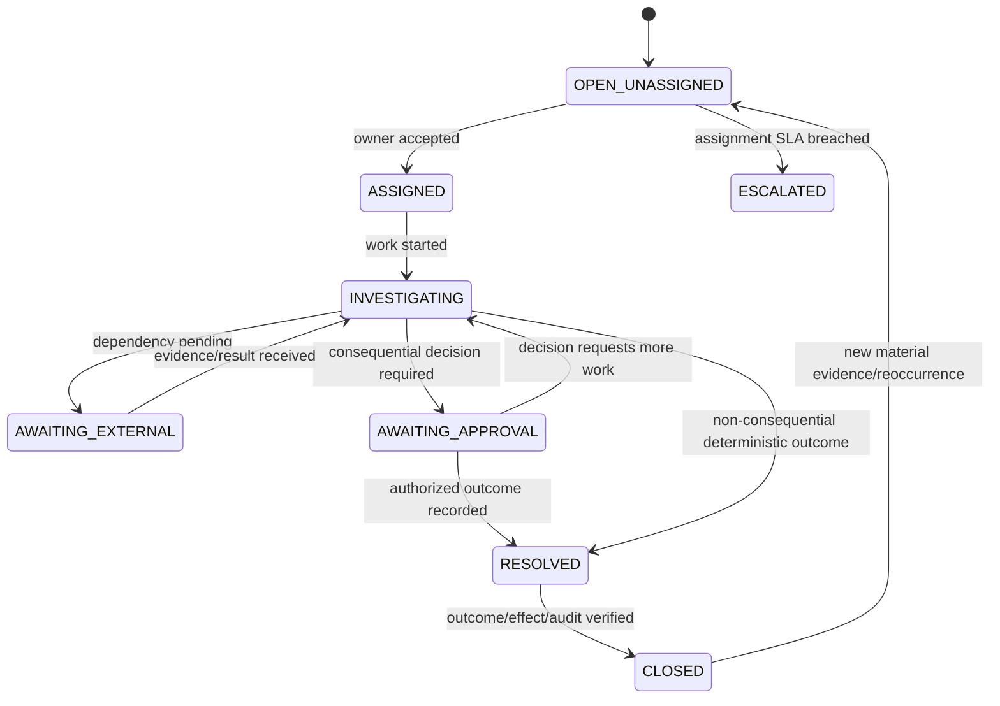

# Stage 5 - Canonical State Machines

**Status:** Draft; legal transitions and guards require domain-owner approval  
**Last updated:** 2026-09-14

## 1. General state-machine rules

- Source statuses are evidence inputs and never directly overwrite canonical state.
- State changes only through controlled events and named guards.
- A transition records previous state, next state, event, evidence, rules, actor and time.
- Unknown/missing P0 evidence prevents progression but does not fabricate a failure fact.
- A late/corrected event rebuilds the projection and may create reassessment work.
- Holds/cases are explicit; they are not hidden in free text.

## 2. Therapy journey phase

Cancellation/discontinuation is a separate authorized terminal transition applicable only under a controlled reason/policy. The challenge does not supply that policy, so it is not shown as an unguarded “from any state” shortcut.

Canonical phase is accompanied by orthogonal assessments for identity/lineage, consent, authorization, site, Quality, logistics, exception severity and data confidence. One phase string cannot express all readiness.

## 3. Identity-resolution case

An AI match/summary never enters `APPROVED` and cannot emit `IdentityResolutionApplied`.

## 4. Capacity command/saga

Terminal replay of the same key/payload returns the stored state/result and emits no duplicate external effect.

## 5. Manufacturing capacity reservation

Scheduler and MES values remain separate assertions; a conflict moves the orchestration view to a case/hold or unknown recovery state rather than choosing one silently.

## 6. Quality release assessment/decision

`APPROVED` is established only by a `ProductReleased` event from the Quality context with authenticated authority and evidence binding. MES `RELEASED` and ERP `AVAILABLE` cannot trigger it.

## 7. Shipment physical state

Thermal/product disposition is a separate Quality decision. `RECEIPT_CONFIRMED` means physical/custody receipt, not product acceptance or infusion readiness.

## 8. Operational exception case

Critical cases cannot remain unassigned beyond the approved assignment SLO. Case closure cannot substitute for the domain decision it references.

## 9. Source-to-canonical status policy

There is no direct one-to-one status mapping. Examples:

| Source assertion | Permitted canonical interpretation |
|---|---|
| Patient `IN_MANUFACTURING` | Evidence hint; verify batch, lineage and MES events before projecting `MANUFACTURING` |
| MES `RELEASED` | Manufacturing-system status only; never `Quality release approved` |
| ERP `AVAILABLE` | Inventory assertion only |
| QMS `RELEASED` | Release source assertion; target requires an authorized release decision/evidence record |
| Shipment `DELIVERED` | Logistics assertion; target requires receipt/custody evidence |
| Scheduler `CONFIRMED` + MES `CANCELLED` | Conflict; open capacity case |
| Consent `WITHDRAWN` | Failed/blocked consent prerequisite from its effective time; no autonomous downstream continuation |

## 10. Approval questions

- Confirm canonical phases and whether eligibility/consent ordering differs by product/jurisdiction.
- Provide cancellation/discontinuation and rework/re-manufacture rules.
- Define required evidence for material-at-manufacturing and product-at-center receipt.
- Define Quality reassessment/supersession behavior after release evidence changes.
- Define exception severity/assignment/escalation SLOs.
