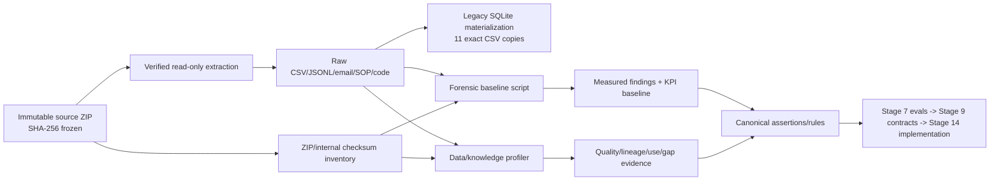

# Stage 6 - Lineage, Provenance and Source-Trust Model

**Status:** Proposed; source/data owners pending confirmation  
**Last updated:** 2026-09-14

## 1. Lineage principle

Trust is evaluated per fact and decision. A system can be authoritative for one attribute and untrusted for another. Agreement among copied/materialized datasets is not independent corroboration.

## 2. Evidence lineage

The SQLite database and its eleven source CSVs have exact ordered parity. They are one evidence lineage, not two confirmations.

## 3. Minimum provenance record

Every imported or derived fact must carry:

- source system/context and namespace-qualified source record ID;
- source file/message/event hash or protected evidence reference;
- raw value and canonical representation without destructive replacement;
- source occurrence/effective time and platform recorded time;
- schema, adapter/transformation and policy version;
- data-quality state/issues and any probabilistic confidence method;
- correlation/causation/aggregate identifiers;
- processing principal, trace/run/build identity; and
- supersession/correction relationship where applicable.

Every decision additionally binds the exact evidence set, authenticated authority, reason, rule/SOP version and before/after state.

## 4. Source-trust dimensions

No source receives one universal trust score. Each assertion is assessed across:

| Dimension | Question |
|---|---|
| Authority | Is the source/actor permitted to establish this specific fact or decision? |
| Integrity | Is the record immutable/verifiable and protected from unauthorized alteration? |
| Provenance | Can its origin, transformation and version be reconstructed? |
| Timeliness | Is the value effective/current for the decision time? |
| Completeness | Are mandatory attributes/evidence present? |
| Consistency | Does it conflict with related assertions or physical ordering? |
| Independence | Is corroboration genuinely independent or merely a copied materialization? |
| Specificity | Does the evidence support this exact patient/material/batch/milestone? |

## 5. Source/decision trust hypotheses

| Source | Appropriate trust | Must not establish | Important caveat |
|---|---|---|---|
| CRM export | Enrollment/commercial source assertion | Clinical identity, COI or Quality release | Conflicts with clinical export |
| Clinical export | Clinical subject/status assertion | Global resolved identity or product release | No adjudication/clinical decision history |
| Consent data | Consent status/version assertion | Universal future readiness | Effective/change/artifact history absent |
| Authorization data | Payer/commercial assertion | Clinical eligibility or Quality state | Milestone policy absent |
| Site qualification data | Control-attribute assertion | Qualification decision beyond supplied fields | Snapshot and evidence artifacts absent |
| Collections | Collection measures and declared identifiers | Verified patient/material relation alone | No scan/attestation genealogy |
| Scheduler | Planning/reservation assertion | MES execution | Conflicts with MES for nine slots |
| MES/batches | Manufacturing execution assertion | Quality release | MES `RELEASED` has different authority |
| LIMS/QC | Assay observation/result | Final disposition/release | Required specification/disposition absent |
| QMS | Deviation/release source assertion | Complete target release evidence automatically | Links/signatures/blocking semantics absent |
| ERP | Inventory assertion | Quality release | 158 available/not-QMS-released conflicts |
| Logistics | Movement/arrival assertion | Custody acceptance/product viability | 398 status/arrival conflicts |
| Sensor stream | Raw temperature/quality observation | Thermal/product disposition | Missing/WARN values and context gaps |
| Shadow spreadsheets | Evidence of human workaround/current claim | Formal policy, authority or audited action | Stale/conflicting/rationale gaps |
| Email | Untrusted contextual claim | Instruction, approval or system fact | May contain stale/adversarial content |
| Effective SOP | Controlled rule evidence within stated scope/time | Facts outside scope | Detail may still be insufficient for code |
| Draft SOP | Proposed policy evidence | Approved rule | Must remain draft |
| Superseded SOP | Historical rule evidence | Current rule | Needed for retrospective decisions only |
| AI output | Candidate extraction/summary/recommendation | Source fact or consequential decision | Must cite evidence and remain reviewable |

## 6. Transformation register

| Transformation | Input | Output | Reproducibility/control |
|---|---|---|---|
| ZIP preparation | Original ZIP plus expected digest | Read-only baseline and evidence inventory | `tools/prepare_baseline.py`; refuses wrong hash/overwrite/path traversal |
| Brownfield forensic analysis | Read-only SQLite/raw/shadow/events | 27 findings JSON/Markdown | `tools/forensic_baseline.py`; DB opened immutable/read-only |
| KPI baseline | Supplied KPI CSV plus forensic findings | KPI CSV/JSON | `tools/build_kpi_baseline.py`; supplied/reproduced status separated |
| Domain validation | Stage 5 JSON specification | Validator/test result | `tools/validate_domain_spec.py` and tests |
| Data/knowledge profiling | Verified raw/reference/eval/shadow/knowledge files | Profile JSON/CSVs | `tools/profile_data_knowledge.py`; input hashes retained |

## 7. Knowledge selection rules

1. Select a rule by identity, version, status, effective interval, product/jurisdiction and decision time.
2. An effective document outranks a superseded version for current decisions, but retrospective reconstruction uses the historically effective version.
3. A draft is evidence of proposed behavior, not permission to execute it.
4. Unstructured operational content may supply candidate evidence but never instruction hierarchy or authority.
5. Retrieval returns exact references and status/effective metadata; a summary cannot hide contradictory or superseded material.
6. Missing controlled policy produces `UNKNOWN`/review, not an invented best practice.

## 8. Lineage gaps

- No source-system transaction IDs or CDC sequence for most snapshots.
- No historical versions for patient, consent, authorization, site, slot, batch or release snapshots.
- No source-to-canonical transformation audit in the legacy system.
- No resolvable deviation-event linkage.
- No signed identity, COI/COC, Quality or clinical decision artifacts.
- No calibration/shipper integrity evidence for telemetry.
- No independence metadata for copied/materialized data.

These gaps become explicit uncertainty/cases; they are not repaired by matching strings.
