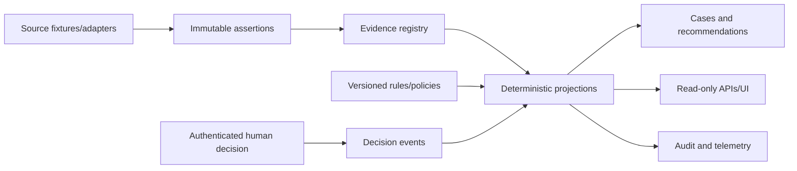

# Stage 9 - Information Architecture

**Status:** APPROVED FOR SYNTHETIC ACADEMIC BUILD

## Core model

The solution preserves source assertions and derives canonical views; it does not overwrite conflicting systems into one “golden patient” row.

## Information classes

| Class | Meaning | Mutation rule |
|---|---|---|
| Source assertion | What a named source stated at a time | Append or supersede; never silently overwrite |
| Evidence reference | Digest-addressed pointer to supporting record | Immutable |
| Canonical projection | Derived state under named rule versions | Rebuildable |
| Command | Requested external effect with canonical payload digest | Durable state machine |
| Recommendation | Non-binding explanation/options | Never a canonical state transition |
| Approval/decision event | Authenticated human-authority outcome | Append-only; payload-bound |
| Audit record | Actor/action/source/time/correlation/result | Append-only and digest chained |

## Identifier policy

Identifiers are typed and non-interchangeable: JourneyId, PatientKey, namespace-qualified MRNAssertion, CollectionId, BagId, COIId, ShipmentId, SlotId, BatchId, DeviationId, CommandId, EventId and EvidenceId. Display labels never substitute for identifiers.

## Time policy

`occurred_at` represents when the domain event happened; `recorded_at` represents when the platform learned it. Effective periods apply to consent, authorization, site qualification, SOPs and policies. Historical “known-at” views use recorded time and remain stable when late evidence arrives.

## Authority policy

Authority belongs to a decision/attribute, not a whole system. QMS authority for release does not make every QMS field authoritative. MES manufacturing status, ERP inventory, courier telemetry and model output cannot establish Quality release.

## Retrieval architecture: structured facts, optional RAG and future MCP

The implemented POC does **not** use vector-search RAG or MCP to determine canonical journey state.

| Information need | Current approach | Why |
|---|---|---|
| Patient identity, readiness, slot state, MES/QC/QMS/logistics facts | Typed source adapters + evidence registry + deterministic projections | Consequential operational truth must be source-, authority- and time-aware |
| SOPs, emails, deviation narratives and other unstructured supporting text | Optional future evidence-grounded RAG | Useful for summarization/search, but retrieved text cannot become release, identity or clinical authority |
| Enterprise tool connectivity | Existing service/adaptor ports in the POC; MCP deferred | MCP may standardize future approved read/tool integrations, but does not replace authentication, authorization, idempotency or domain authority |

If RAG is added, retrieval must preserve source/version/effective date, access policy, provenance and citation. Retrieved content is untrusted evidence, never an instruction to the model. System policy, Quality release authority and clinical/identity rules remain versioned deterministic controls.

MCP is therefore a **future integration option**, not a missing requirement for this capstone. Any MCP server/tool would still sit behind least privilege, role/scope authorization, tool allow-lists, audit, payload validation and human approval for consequential actions.
