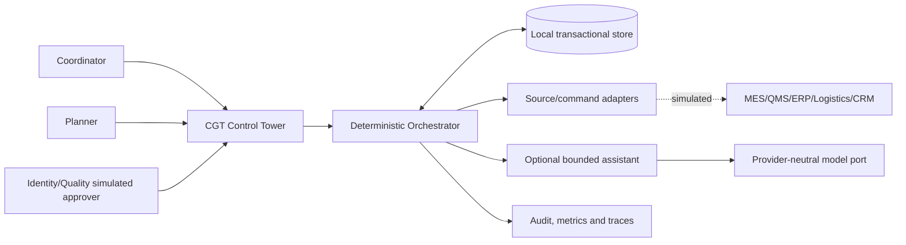

# Stage 10 - Application and AI Architecture

**Status:** APPROVED FOR SYNTHETIC ACADEMIC BUILD

## Context

## Containers and components

| Container/module | Responsibility | Forbidden responsibility |
|---|---|---|
| API/UI | Read views, submit scoped commands/decisions | Derive authority from request body |
| Domain | Rules, states, evidence and time semantics | Network/database access |
| Application services | POC workflows and transactions | Silent policy inference |
| SQLite adapter | Events, commands, cases, audit and fixtures | Business-rule authority |
| Source adapters | Normalize source-specific assertions | Global truth merge |
| Command adapter | Simulated reserve/query/compensate | Blind retry |
| Assistant gateway | Validate evidence-bound recommendation | State transition or consequential command |
| Observability | Trace, metric, audit and evaluation evidence | Sensitive raw prompt logging |

## Runtime modes

- `AI_MODE=off` — default, fully deterministic.
- `AI_MODE=fake` — deterministic test adapter for schema/failure evaluation.
- A future live mode is intentionally absent until a provider/model and permissible-use decision exists.

## Deployment

One process and one local SQLite database support repeatable academic execution. The image exposes a health endpoint and runs as a non-root user. External systems are simulated through ports. Production topology, HA, managed secrets and validated signatures are explicitly outside scope.
