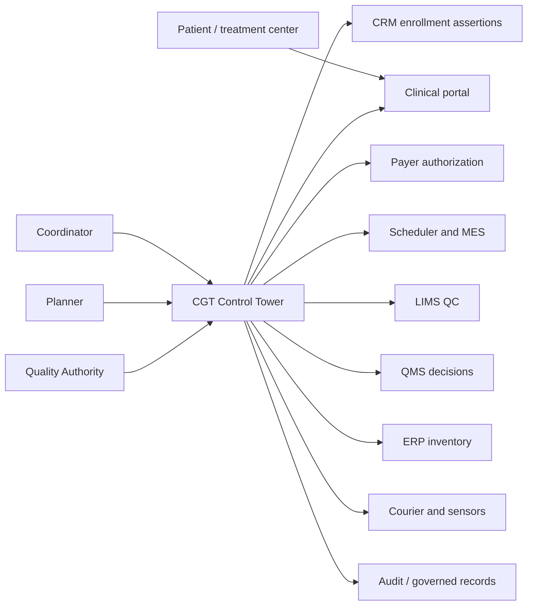
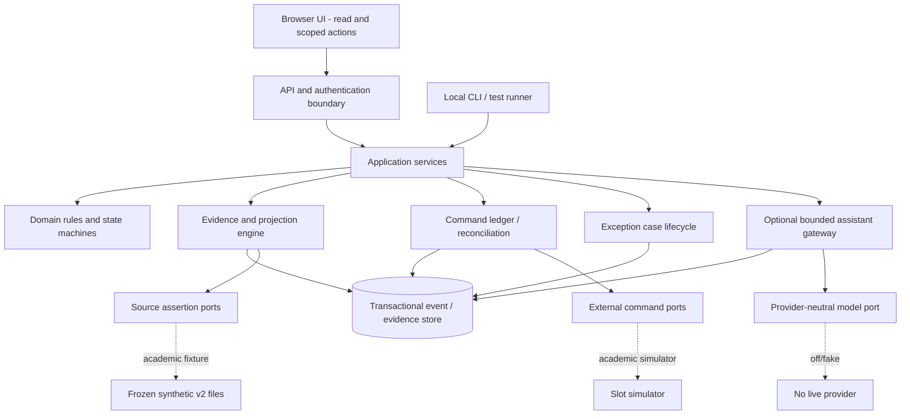
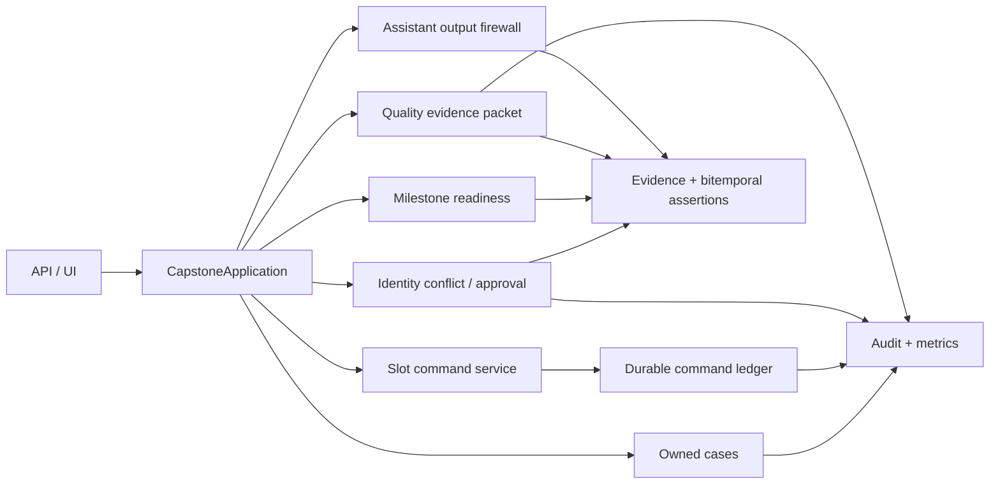

# Target C4 Baseline and As-Built Delta

**Status:** Target design for a synthetic academic increment; no production topology approval
**Related:** Stage 9 contracts; Stage 11 assistant boundary; Stage 12 trust controls; Stage 13 migration strategy; Stage 14 as-built architecture

## C4 level 1 - system context

Each source owns only the assertions or decisions documented in the Stage 5 authority map. The Control Tower is a projection and governed workflow layer, not a universal master system. The dotted enterprise connections described in earlier design remain simulated or absent in the academic build.

## C4 level 2 - containers

The academic container is a modular Python process with SQLite, FastAPI, CLI and browser assets. Production HA, enterprise IAM, secrets, e-signatures, network isolation, retention and failover remain technology decisions for a real program.

## C4 level 3 - application components

Identity, slot and release approvals are enforced in services against server-side principal/role/scope policy; a browser label or model field has no authority. Missing or contradictory source assertions produce an owned case or `UNKNOWN`, never an invented canonical transition.

## Contracts, trust boundaries and failure behavior

| Boundary | Contract/control | Failure behavior |
|---|---|---|
| Browser to API | Scoped principal; typed request; server authorization | Deny and audit; no partial effect |
| Source to evidence | Source namespace, locator/digest, schema, occurred/recorded time | Quarantine or `UNKNOWN`; do not clean source history |
| Services to command port | Idempotency key, payload digest, correlation and query/reconcile | `OUTCOME_UNKNOWN`; no blind retry |
| Deterministic context to assistant | Evidence allowlist, output schema, one call, no consequential tool | Reject output or fall back to AI off |
| Quality decision to journey | Authorized QMS/Quality event plus required packet | No release from MES, ERP, courier or AI |

## Planned API versus academic as-built

Stage 10 lists a target set of journey, identity, readiness, slot, reconciliation, Quality and recommendation use cases. The as-built FastAPI intentionally exposes only the browser/demo/status/health surface, a Quality packet read, a command read, and a simulated slot reservation. Identity and Quality decisions are exercised through shared application services and tests, not all target HTTP routes. This is a product/API coverage gap to trace in the PRD and backlog, not evidence that the target C4 has been deployed.

The migration path and cutover gates are in `docs/stages/stage_13/08_BROWNFIELD_MIGRATION_STRATEGY.md`; Stage 14 records only the local as-built view. A changed container topology, live provider or consequential source adapter requires new ADR, threat, impact, evaluation and owner approvals.
