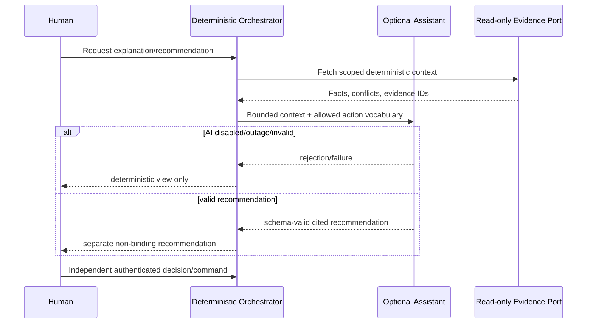

# Stage 11 - Agentic Orchestration Design

**Decision:** One bounded assistant; no multi-agent system.

## Tools and authority

| Tool/port | Assistant access | Human/service access |
|---|---|---|
| Read scoped evidence | Allow | Allow by scope |
| Read deterministic projection | Allow | Allow by scope |
| Draft summary/options | Allow | Allow |
| Resolve identity | Deny | Identity Authority service only |
| Reserve/change slot | Deny | Authorized Planner command only |
| Dispose/release product | Deny | Quality Authority service only |
| Clinical decision/action | Deny | Outside POC |

## Control loop

One request permits one model call and one schema-validation pass. There is no self-reflection or recursive tool loop. Timeout, malformed output, unauthorized field, missing citation or conflict ends the assistant path and returns deterministic context. Memory is request-scoped; no cross-patient or long-term model memory exists.

## Handoff

The assistant may suggest an allowed next action but cannot create its case or execute it. The orchestrator creates owned cases deterministically. Human decisions bind authenticated role, exact payload/evidence version and correlation ID. Stale evidence invalidates the recommendation.
