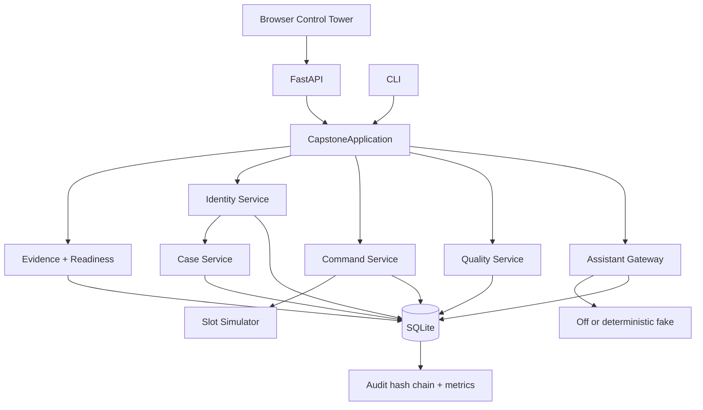

# Stage 14 - As-Built Architecture

There are no background autonomous agents, vector database, external network dependency, live model, or production integration. The modular seams are Python service/adaptor interfaces; SQLite is a POC implementation detail behind `Database`.
