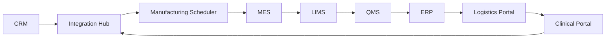

# Current-State Architecture (Intentionally Incomplete)

**Warning:** this diagram reflects how the architecture is described in one governance document, not necessarily how production behaves. Participants should validate it against code, interfaces, synthetic records, shadow files and events.
